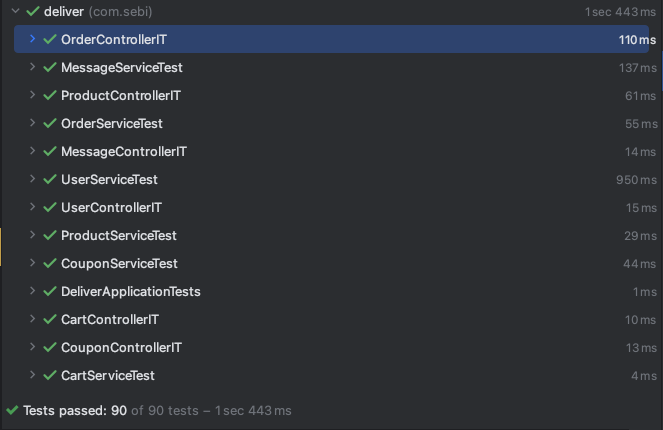
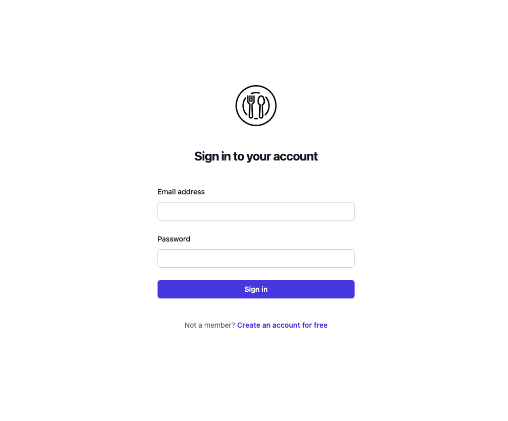
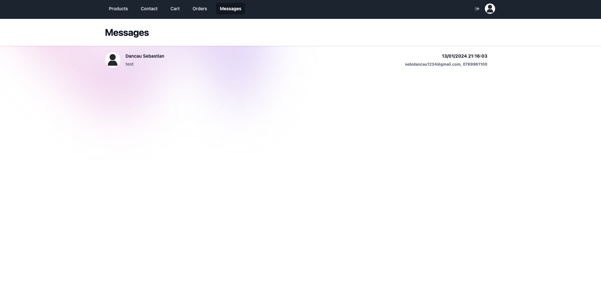
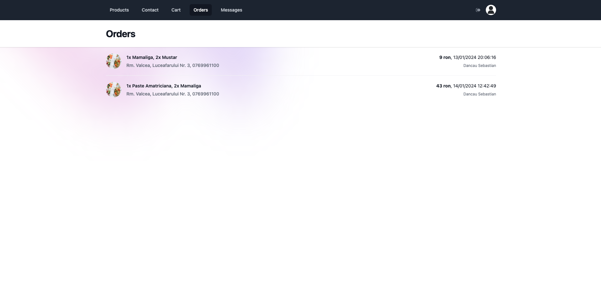
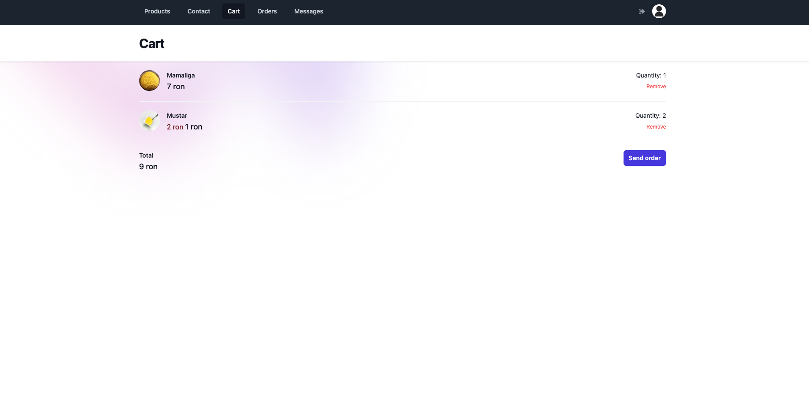
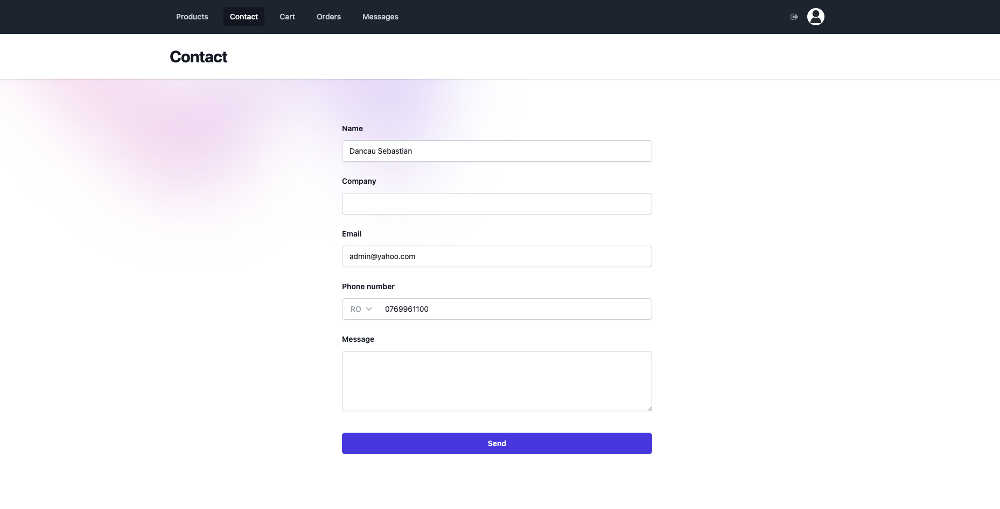
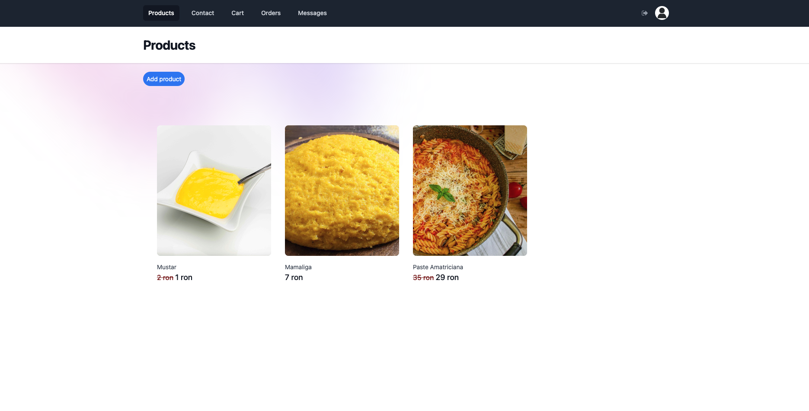

# JAVA PROJECT

## Descriere proiect
Proiectul este o aplicație pentru gestionarea unui restaurant online. Aplicația permite utilizatorilor să se autentifice, să adauge produse în coșul de cumpărături, să plaseze comenzi, să administreze produsele și utilizatorii, să aplice cupoane de reducere, să trimită mesaje către administratori și să vizualizeze catalogul de produse. Tehnologiile folosite includ Java (Spring), MariaDB, Docker, Node.js, Express și Ejs. Aplicația are și o documentație Swagger și este testată cu teste unitare și de integrare.

## Business requirements
1. Autentificare utilizatori: Sistemul trebuie să permită utilizatorilor să se autentifice în aplicație.
2. Adăugare produse în coș: Utilizatorii trebuie să poată adăuga produse în coșul de cumpărături.
3. Plasare comenzi: Utilizatorii trebuie să poată plasa comenzi pentru produsele din coș.
4. Administrare produse: Administratorii trebuie să poată adăuga, actualiza și șterge produse din sistem.
5. Administrare utilizatori: Administratorii trebuie să poată gestiona utilizatorii, inclusiv crearea, actualizarea și ștergerea conturilor.
6. Cupoane de reducere: Sistemul trebuie să permită utilizatorilor să aplice cupoane de reducere la comenzi.
7. Mesagerie: Utilizatorii trebuie să poată trimite mesaje către administratori.
8. Vizualizare produse: Utilizatorii trebuie sa poate naviga prin catalogul de produse.
9. Gestionare detalii cont: Utilizatorii trebuie sa poate vedea si actualiza detalii despre contul lor, precum adresa, numele etc.
10. Review: Utilizatorii pot sa acorde note restaurantului, in functie de experientele lor.

## Faza MVP
In aceasta faza, proiectul acopera urmatoarele aspecte:  
1. Administratori: pot vedea, gestiona, adauga, actualiza si sterge produse
2. Utilizatori: pot vedea catalogul de produse si pot adauga produse in cos
3. Autentificare: pot sa isi creeze un cont si sa se autentifice in viitor cu el
4. Mesagerie: Utilizatorii pot sa trimita mesaje, iar administratorii le pot vedea
5. Utilizatorii pot comanda produse si pot vedea comenzile lor anterioare

## Tehnologii folosite
- java (spring)
- mariadb
- docker
- node
- express
- ejs
- docker

## Link-uri
- swagger: http://localhost:8080/swagger-ui/index.html
- website: http://localhost:8282/login
- backend: http://localhost:8080/api

## Structura baza de date
- users
- products
- cartItem (produsele pe care un user le are in cart)
- orders (comenzile utilizatorilor)
- message (mesajul trimis de un utilizator catre admin)
- coupon (un cupon de reducere, asociat unui utilizator)

## Testare
- teste unitare si de integrare pentru toate endpoints

## Backend
- structura:
    - model + repository + service + controller + dto + exceptions

## Frontend:
- 2 layers:
    - express, unde luam datele de la server si faceam routing-ul
    - html + ejs + tailwind, unde afisam datele utilizatorului

## Baza de date:
- mariadb, rulata cu docker, volume atasate pentru persistenta datelor

## Screenshots

## Swagger documentation
[documentation](swagger-documentation.pdf)